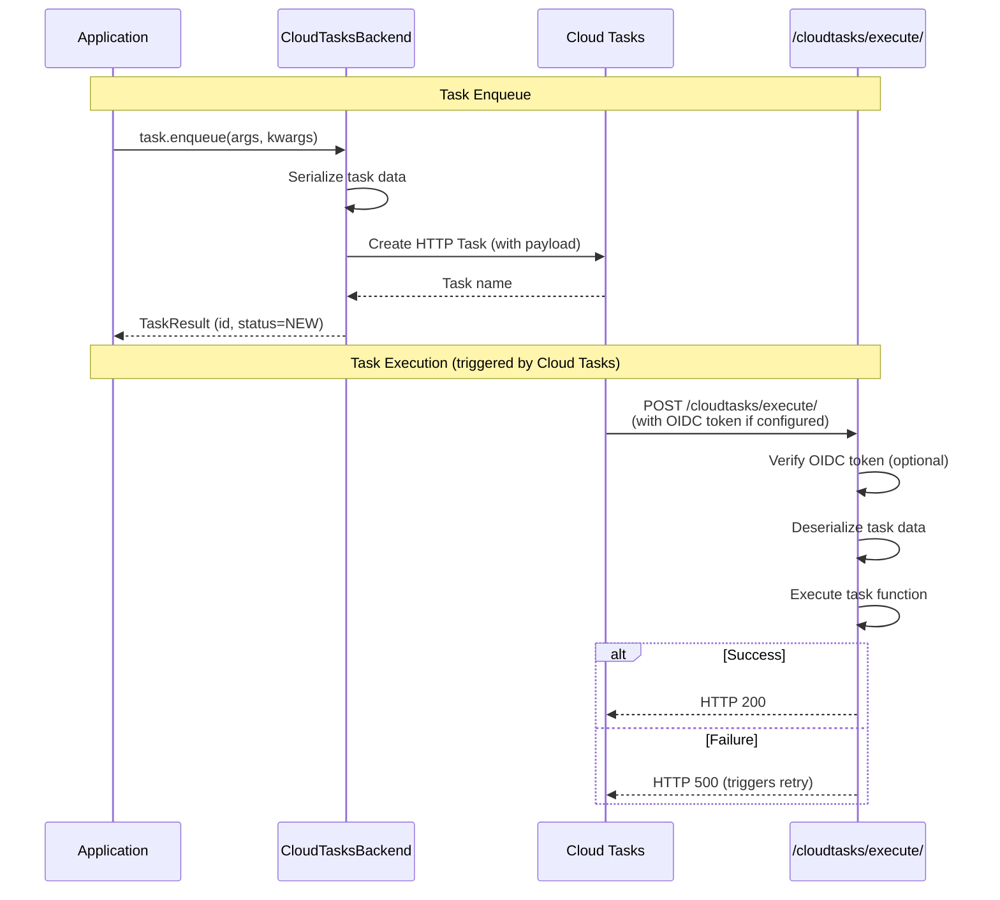

# django-tasks-cloud-tasks

A Google Cloud Tasks backend for Django 6.0's built-in task framework.

## Features

- **Cloud Tasks integration** - Enqueue tasks to Google Cloud Tasks
- **HTTP callback execution** - Tasks are executed via HTTP POST requests from Cloud Tasks
- **OIDC authentication** - Secure task execution with OIDC token verification
- **Auto-detection** - Automatically detects GCP project, location, and service URL on Cloud Run/App Engine
- **Priority support** - Tasks can have priorities
- **Delayed execution** - Schedule tasks to run at a specific time with `run_after`
- **Task context** - Access task metadata via context

## Architecture



## Requirements

- Python 3.12+
- Django 6.0+
- google-cloud-tasks
- google-auth (for OIDC verification)

## Installation

```bash
pip install django-tasks-cloud-tasks
```

Or install with dependencies:

```bash
pip install django-tasks-cloud-tasks google-cloud-tasks google-auth
```

## Quick Start

### 1. Add to INSTALLED_APPS

```python
INSTALLED_APPS = [
    # ...
    'django_tasks_cloud_tasks',
]
```

### 2. Configure the task backend

**On Cloud Run / App Engine**, all settings are auto-detected from the environment. You only need:

```python
TASKS = {
    'default': {
        'BACKEND': 'django_tasks_cloud_tasks.CloudTasksBackend',
        'QUEUES': [],  # Empty list allows all queue names
    },
}
```

> **Note:** On GCP environments (Cloud Run, App Engine, GCE), the following are automatically detected:
> - **Project ID**: from `GOOGLE_CLOUD_PROJECT` env var or GCP metadata server
> - **Location**: from `CLOUD_TASKS_LOCATION`, `CLOUD_RUN_REGION` env var, or metadata server
> - **Service URL**: from `SERVICE_URL` env var, or generated from `K_SERVICE` (Cloud Run) / `GAE_SERVICE` (App Engine)
> - **Service Account**: from metadata server (for OIDC authentication)
>
> **About Service Accounts:** On GCP, applications run with a **runtime service account** (not API keys or JSON key files). Cloud Run, App Engine, and GCE automatically provide credentials via the metadata server. You don't need to create or download any key files.
>
> Simply grant the `roles/cloudtasks.enqueuer` role to your runtime service account:
> ```bash
> # For Cloud Run (uses Compute Engine default service account by default)
> gcloud projects add-iam-policy-binding PROJECT_ID \
>     --member="serviceAccount:PROJECT_NUMBER-compute@developer.gserviceaccount.com" \
>     --role="roles/cloudtasks.enqueuer"
> ```
> The backend will automatically use these credentials for both creating tasks and OIDC authentication.

**For local development**, set environment variables:

```bash
export GOOGLE_CLOUD_PROJECT="your-project-id"
export CLOUD_TASKS_LOCATION="asia-northeast1"
export SERVICE_URL="http://localhost:8000"
```

With these environment variables set, the same minimal configuration works:

```python
TASKS = {
    'default': {
        'BACKEND': 'django_tasks_cloud_tasks.CloudTasksBackend',
        'QUEUES': [],
    },
}
```

Or configure explicitly in settings:

```python
TASKS = {
    'default': {
        'BACKEND': 'django_tasks_cloud_tasks.CloudTasksBackend',
        'QUEUES': [],
        'OPTIONS': {
            'CLOUD_TASKS_PROJECT': 'your-project-id',
            'CLOUD_TASKS_LOCATION': 'asia-northeast1',
            'TASK_HANDLER_HOST': 'http://localhost:8000',
        },
    },
}
```

### 3. Add URL configuration

```python
# urls.py
from django.urls import path, include

urlpatterns = [
    path('cloudtasks/', include('django_tasks_cloud_tasks.urls')),
]
```

### 4. Define a task

```python
from django.tasks import task

@task
def send_welcome_email(user_id):
    user = User.objects.get(id=user_id)
    # Send email...
    return f"Email sent to {user.email}"
```

### 5. Enqueue the task

```python
result = send_welcome_email.enqueue(user_id=123)
print(f"Task ID: {result.id}")
```

### 6. Create Cloud Tasks queue

```bash
gcloud tasks queues create default --location=asia-northeast1
```

## Usage

### Important: JSON-Serializable Parameters

Task arguments, keyword arguments, and return values **must be JSON-serializable**.

Supported types:
- `str`, `int`, `float`, `bool`, `None`
- `dict` (with JSON-serializable keys and values)
- `list`, `tuple` (with JSON-serializable elements)

**Not supported** (will raise `TypeError`):
- `datetime`, `date`, `time` - convert to ISO string: `dt.isoformat()`
- `UUID` - convert to string: `str(uuid)`
- `Decimal` - convert to float or string
- Custom objects - serialize manually

```python
from django.tasks import task

# ❌ This will raise TypeError
@task
def bad_task(user_id, created_at):
    pass
bad_task.enqueue(123, datetime.now())  # TypeError!

# ✅ Convert to JSON-serializable types
@task
def good_task(user_id, created_at_iso):
    created_at = datetime.fromisoformat(created_at_iso)
    # ...
good_task.enqueue(123, datetime.now().isoformat())  # OK
```

### Task with priority

```python
@task(priority=10)  # Higher priority
def urgent_task():
    pass

@task(priority=-10)  # Lower priority
def background_task():
    pass
```

### Delayed execution

```python
from datetime import timedelta
from django.utils import timezone

# Run 1 hour from now
delayed_task = my_task.using(run_after=timezone.now() + timedelta(hours=1))
result = delayed_task.enqueue()
```

### Task with context

```python
@task(takes_context=True)
def task_with_context(context, message):
    task_id = context.task_result.id
    attempt = context.attempt
    return f"Task {task_id} (attempt {attempt}): {message}"
```

### Queue-specific tasks

```python
@task(queue_name="high-priority")
def urgent_notification():
    pass

# Create the queue in Cloud Tasks
# gcloud tasks queues create high-priority --location=asia-northeast1
```

## Configuration Options

```python
TASKS = {
    'default': {
        'BACKEND': 'django_tasks_cloud_tasks.CloudTasksBackend',
        'QUEUES': [],  # Empty list allows all queue names
        'OPTIONS': {
            # Auto-detected on Cloud Run / App Engine, or set explicitly
            'CLOUD_TASKS_PROJECT': 'your-project-id',
            'CLOUD_TASKS_LOCATION': 'asia-northeast1',
            'TASK_HANDLER_HOST': 'https://your-app.run.app',
            'TASK_HANDLER_PATH': '/cloudtasks/execute/',  # default

            # Optional: OIDC authentication
            'OIDC_SERVICE_ACCOUNT_EMAIL': 'cloud-tasks-invoker@your-project.iam.gserviceaccount.com',
            'OIDC_AUDIENCE': 'https://your-app.run.app',
        },
    },
}
```

### Configuration Reference

| Option | Required | Description |
|--------|----------|-------------|
| `CLOUD_TASKS_PROJECT` | Auto-detected | GCP project ID |
| `CLOUD_TASKS_LOCATION` | Auto-detected | Cloud Tasks location (e.g., `asia-northeast1`) |
| `TASK_HANDLER_HOST` | Auto-detected | Base URL for task execution endpoint |
| `TASK_HANDLER_PATH` | No | Task execution endpoint path (default: `/cloudtasks/execute/`) |
| `OIDC_SERVICE_ACCOUNT_EMAIL` | No | Service account email for OIDC token |
| `OIDC_AUDIENCE` | No | OIDC audience (defaults to TASK_HANDLER_HOST) |

### Auto-Detection

Settings are automatically detected from environment variables or GCP metadata:

| Setting | Detection Source |
|---------|------------------|
| `CLOUD_TASKS_PROJECT` | `GOOGLE_CLOUD_PROJECT` env var, or metadata server |
| `CLOUD_TASKS_LOCATION` | `CLOUD_TASKS_LOCATION`, `CLOUD_RUN_REGION` env var, or metadata server |
| `TASK_HANDLER_HOST` | `SERVICE_URL` env var, or built from `K_SERVICE` (Cloud Run) / `GAE_SERVICE` (App Engine) |

### Environment Variables

For local development:

| Environment Variable | Description |
|---------------------|-------------|
| `GOOGLE_CLOUD_PROJECT` | GCP project ID |
| `CLOUD_TASKS_LOCATION` | Cloud Tasks location |
| `SERVICE_URL` | Task execution endpoint URL |
| `CLOUD_TASKS_EMULATOR_HOST` | Cloud Tasks emulator host (for local development) |

## HTTP Endpoint

### POST `/cloudtasks/execute/`

Task execution endpoint called by Cloud Tasks.

Request body (JSON):
```json
{
  "task_id": "uuid",
  "task_path": "myapp.tasks.send_email",
  "args": [1, 2, 3],
  "kwargs": {"key": "value"},
  "queue_name": "default",
  "backend": "default",
  "priority": 0,
  "takes_context": false,
  "enqueued_at": "2024-01-01T00:00:00+00:00"
}
```

Response (success):
```json
{"status": "success", "task_id": "uuid"}
```

Response (error):
```json
{"status": "error", "task_id": "uuid", "error": "Error message"}
```

## OIDC Authentication

When deploying to production, enable OIDC authentication to secure the task execution endpoint.

### Setup

1. Create a service account for OIDC:
   ```bash
   gcloud iam service-accounts create cloud-tasks-invoker \
       --display-name="Cloud Tasks Invoker"
   ```

2. Grant required roles:
   ```bash
   # Allow your service to create Cloud Tasks
   gcloud projects add-iam-policy-binding PROJECT_ID \
       --member="serviceAccount:PROJECT_ID@appspot.gserviceaccount.com" \
       --role="roles/cloudtasks.enqueuer"

   # Allow impersonation for OIDC
   gcloud iam service-accounts add-iam-policy-binding \
       cloud-tasks-invoker@PROJECT_ID.iam.gserviceaccount.com \
       --member="serviceAccount:PROJECT_ID@appspot.gserviceaccount.com" \
       --role="roles/iam.serviceAccountUser"
   ```

3. Configure the backend:
   ```python
   TASKS = {
       'default': {
           'BACKEND': 'django_tasks_cloud_tasks.CloudTasksBackend',
           'QUEUES': [],  # Empty list allows all queue names
           'OPTIONS': {
               # CLOUD_TASKS_PROJECT, CLOUD_TASKS_LOCATION, TASK_HANDLER_HOST are auto-detected on Cloud Run
               'OIDC_SERVICE_ACCOUNT_EMAIL': 'cloud-tasks-invoker@PROJECT_ID.iam.gserviceaccount.com',
           },
       },
   }
   ```

## Local Development

### Without Cloud Tasks Emulator

You can manually simulate task execution:

```bash
# Start Django server
export GOOGLE_CLOUD_PROJECT="your-project-id"
export CLOUD_TASKS_LOCATION="asia-northeast1"
export SERVICE_URL="http://localhost:8000"
python manage.py runserver

# Simulate task execution
curl -X POST http://localhost:8000/cloudtasks/execute/ \
  -H "Content-Type: application/json" \
  -d '{
    "task_id": "test-task-001",
    "task_path": "myapp.tasks.add_numbers",
    "args": [5, 3],
    "kwargs": {},
    "queue_name": "default",
    "backend": "default",
    "priority": 0,
    "takes_context": false,
    "enqueued_at": "2024-01-01T00:00:00+00:00"
  }'
```

### With Cloud Tasks Emulator

```bash
# Start Cloud Tasks emulator
gcloud beta emulators tasks start --host-port=localhost:8123

# Set environment variables
export CLOUD_TASKS_EMULATOR_HOST=localhost:8123
export GOOGLE_CLOUD_PROJECT="sample-project"
export CLOUD_TASKS_LOCATION="asia-northeast1"
export SERVICE_URL="http://localhost:8000"

# Create queues
gcloud tasks queues create default --location=asia-northeast1 --project=sample-project

# Start Django server
python manage.py runserver
```

## Deployment to Cloud Run

### 1. Create Dockerfile

```dockerfile
FROM python:3.12-slim

WORKDIR /app

COPY requirements.txt .
RUN pip install --no-cache-dir -r requirements.txt

COPY . .

CMD ["gunicorn", "--bind", ":8080", "myproject.wsgi:application"]
```

### 2. Deploy

```bash
# Deploy to Cloud Run
gcloud run deploy myapp \
  --source . \
  --region asia-northeast1 \
  --allow-unauthenticated

# Create Cloud Tasks queues
gcloud tasks queues create default --location asia-northeast1
gcloud tasks queues create high-priority --location asia-northeast1
```

### 3. Configuration

All settings are auto-detected on Cloud Run. No additional configuration needed for basic usage.

## Example Project

See the [examples/](examples/) directory for a complete sample project with a web UI for testing task enqueueing.

## License

MIT License
